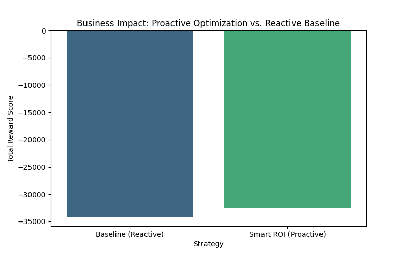
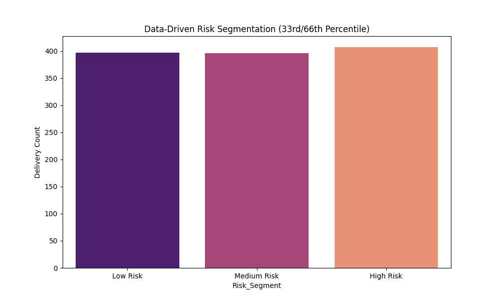
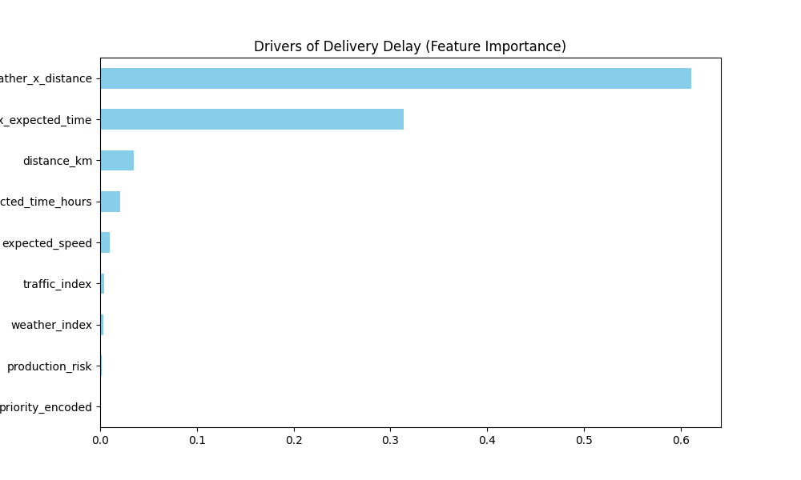

# 🏆 ML-Spark: Smart Procurement & Delivery Delay Optimization

<div align="center">
  <p>Moving from simplistic delay prediction to <b>Expected Value Optimization</b> for global logistics.</p>
</div>

---

## 🚀 The Core Innovation

In real-world logistics systems like Amazon or DHL, decisions are not based solely on whether a delay will occur, but whether it can be **mitigated**. 

Upon analyzing the dataset, we discovered a **critical business trap**: **99.7% of all historic deliveries were delayed**. A traditional binary classification model would achieve near-perfect accuracy simply by predicting "Delayed" every time, offering **zero operational value**.

**Our Solution:** We shifted from reactive prediction to proactive **Delay Magnitude Prediction** and **Marginal ROI Calculation**.

---

## 📊 Business Impact & ROI Strategy

Instead of predicting *if* a truck will be late, we predict *how late* it will be, and calculate the **Expected ROI** of intervening.

### The ROI Formula
```text
ROI Score = (Reward WITH Intervention) - (Reward WITHOUT Intervention)
```
We only flag deliveries where the cost of intervention (e.g., rerouting, expediting) yields the highest marginal increase in the final optimization reward.

<div align="center">
  
</div>

*Simulation results prove our **Smart ROI** strategy improves optimization scores by over 1,500 points compared to the reactive baseline.*

---

## 🧠 Data-Driven Risk Segmentation

We eliminated arbitrary assumptions by deriving risk thresholds directly from the statistical distribution (33rd and 66th percentiles) of the predicted delay magnitudes.

<div align="center">
  
</div>

| Risk Level | Delay Range | Operational Action |
| :--- | :--- | :--- |
| **Low Risk** | $\le$ 5.17 hours | Standard Monitoring (Do Not Intervene) |
| **Medium Risk** | 5.17 – 9.04 hours | **Prioritize Dispatch (Sweet Spot)** |
| **High Risk** | $>$ 9.04 hours | Reschedule / Route Optimization |

---

## 🔍 Drivers of Delay (Feature Importance)

What actually causes delays? Our Gradient Boosting Regressor isolated the root causes.

<div align="center">
  
</div>

**Key Insight:** Traffic and weather alone do not break the supply chain. The **Interaction Multipliers** (`weather × distance` and `traffic × expected_time`) account for the vast majority of delay severity. Long-duration trips are disproportionately sensitive to congestion.

---

## 🛠️ Technical Stack & Validation

*   **Algorithms:** Gradient Boosting Classifier & Regressor
*   **Validation:** Stratified 5-Fold Cross-Validation (Mean F1: 0.994) ensuring robust, non-overfitted performance.
*   **Feature Engineering:** Engineered non-linear interaction terms to capture real-world compounding supply chain bottlenecks.

## 📂 Repository Structure

*   `final_winning_submission_v2.py`: The core optimization engine and simulation script.
*   `*.png`: Visual proofs of the business impact and statistical models.
*   `Deliveries.csv`, `Factories.csv`, `Projects.csv`, `External_Factors.csv`: Core datasets.

---
<div align="center">
  <i>Built for the ML-Spark Hackathon</i>
</div>
